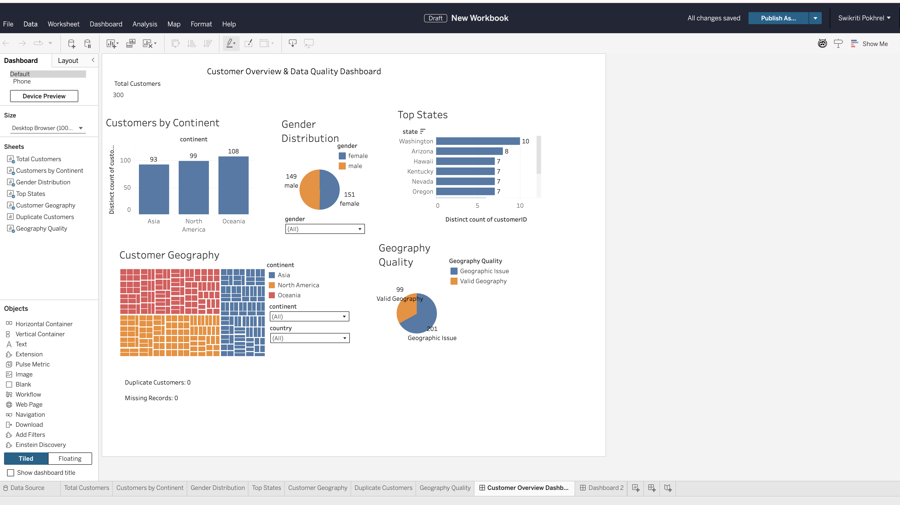

# Customer Overview & Data Quality Dashboard

## Project Overview
This project analyzes customer demographic and geographic data using SQL in Databricks and Tableau.

The goal was to validate the dataset, identify data quality issues, and create an interactive dashboard for customer analysis.

## Tools
- Databricks
- SQL
- Tableau

## Data Quality Checks

### Duplicate Customers
Duplicate customer IDs were checked using SQL.

**Result:** 0 duplicate customers.

### Missing Data
Key customer fields were checked for NULL values.

**Result:** 0 records with missing data.

### Geographic Consistency
The dataset contained U.S. state names associated with non-U.S. countries.

Examples included U.S. states associated with Australia and Japan.

**Results:**
- Australia: 108 geographic inconsistencies
- Japan: 93 geographic inconsistencies
- Total geographic inconsistencies: 201
- Valid geography records: 99

## Dashboard Features
- Total Customers KPI
- Customers by Continent
- Gender Distribution
- Top States
- Customer Geography Treemap
- Geography Quality Analysis
- Continent, Country, and Gender filters

## Dashboard

## Key Findings
- Total customers analyzed: 300
- No duplicate customer IDs were found
- No missing values were found in the key fields analyzed
- 201 of 300 records contained geographic inconsistencies based on the state-country validation rule

## Skills Demonstrated
- SQL data validation
- NULL and duplicate detection
- Data quality analysis
- Aggregation and grouping
- Tableau calculated fields
- Interactive filters
- Dashboard design
- Data visualization
